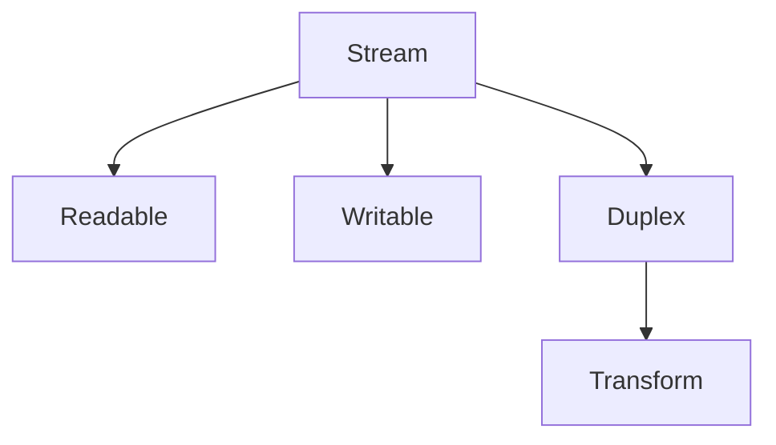

# 🌊 Node.js Streams Guide

Working with large amounts of data in Node.js applications can be a double-edged sword. The ability to handle massive amounts of data is extremely handy but can also lead to performance bottlenecks and memory exhaustion. Traditionally, developers tackled this challenge by reading the entire dataset into memory at once. This approach, while intuitive for smaller datasets, becomes inefficient and resource-intensive for large data (e.g., files, network requests…).

This is where **Node.js streams** come in. Streams offer a fundamentally different approach, allowing you to process data incrementally and optimize memory usage. By handling data in manageable chunks, streams empower you to build scalable applications that can efficiently tackle even the most daunting datasets. As popularly quoted, *“streams are arrays over time.”*

In this guide, we give an overview of the Stream concept, history, and API as well as some recommendations on how to use and operate them.

---

## 📑 Table of Contents
- [What are Node.js Streams?](#what-are-nodejs-streams)
- [Event-Driven Architecture](#event-driven-architecture)
- [Why use Streams?](#why-use-streams)
- [Stream History](#stream-history)
- [Stream Types](#stream-types)
  - [Readable Streams](#readable)
  - [Writable Streams](#writable)
  - [Duplex Streams](#duplex)
  - [Transform Streams](#transform)
- [How to operate with streams](#how-to-operate-with-streams)
  - [.pipe()](#pipe)
  - [pipeline()](#pipeline)
  - [Async Iterators](#async-iterators)
- [Object Mode](#object-mode)
- [Backpressure](#backpressure)
- [Streams vs Web streams](#streams-vs-web-streams)

---

## 🧐 What are Node.js Streams?

Node.js streams offer a powerful abstraction for managing data flow in your applications. They excel at processing large datasets, such as reading or writing from files and network requests, without compromising performance.

This approach differs from loading the entire dataset into memory at once. Streams process data in **chunks**, significantly reducing memory usage. All streams in Node.js inherit from the `EventEmitter` class, allowing them to emit events at various stages of data processing. These streams can be readable, writable, or both, providing flexibility for different data-handling scenarios.

### 🏗️ Event-Driven Architecture
Node.js thrives on an event-driven architecture, making it ideal for real-time I/O. This means consuming input as soon as it's available and sending output as soon as the application generates it. Streams seamlessly integrate with this approach, enabling continuous data processing.

They achieve this by emitting events at key stages. These events include signals for received data (`data` event) and the stream's completion (`end` event). Developers can listen to these events and execute custom logic accordingly. This event-driven nature makes streams highly efficient for the processing of data from external sources.

---

## 🚀 Why use Streams?

Streams provide three key advantages over other data-handling methods:

1.  **Memory Efficiency**: Streams process data incrementally, consuming and processing data in chunks rather than loading the entire dataset into memory. This is a major advantage when dealing with large datasets, as it significantly reduces memory usage and prevents memory-related performance issues.
2.  **Improved Response Time**: Streams allow for immediate data processing. When a chunk of data arrives, it can be processed without waiting for the entire payload or dataset to be received. This reduces latency and improves your application's overall responsiveness.
3.  **Scalability for Real-Time Processing**: By handling data in chunks, Node.js streams can efficiently handle large amounts of data with limited resources. This scalability makes streams ideal for applications that process high volumes of data in real time.

These advantages make streams a powerful tool for building high-performance, scalable Node.js applications, particularly when working with large datasets or real-time data processing.

> [!WARNING]
> ### Note on performance
> If your application already has all the data readily available in memory, using streams might add unnecessary overhead, complexity, and slow down your application.

---

## 📜 Stream History

> [!NOTE]
> This section is a reference of the history of streams in Node.js. Unless you’re working with a codebase written for a Node.js version prior to 0.11.5 (2013), you will rarely encounter older versions of the streams API, but the terms might still be in use.

### Streams 0
The first version of streams was released at the same time as Node.js. Although there wasn't a `Stream` class yet, different modules used the concept and implemented the read/write functions. The `util.pump()` function was available to control the flow of data between streams.

### Streams 1 (Classic)
With the release of Node v0.4.0 in 2011, the `Stream` class was introduced, as well as the `.pipe()` method.

### Streams 2
In 2012, with the release of Node v0.10.0, Streams 2 were unveiled. This update brought new stream subclasses, including `Readable`, `Writable`, `Duplex`, and `Transform`. Additionally, the `readable` event was added. To maintain backwards compatibility, streams could be switched to the old mode by adding a `data` event listener or calling `pause()` or `resume()` methods.

### Streams 3
In 2013, Streams 3 were released with Node v0.11.5, to address the problem of a stream having both a `data` and `readable` event handlers. This removed the need to choose between 'current' and 'old' modes. Streams 3 is the current version of streams in Node.js.

---

## 🌊 Stream Types



### 📖 Readable
`Readable` is the class that we use to sequentially read a source of data. Typical examples of Readable streams in Node.js API are `fs.ReadStream` when reading files, `http.IncomingMessage` when reading HTTP requests, and `process.stdin` when reading from the standard input.

#### Key Methods and Events
A readable stream operates with several core methods and events that allow fine control over data handling:

-   `on('data')`: This event is triggered whenever data is available from the stream. It is very fast, as the stream pushes data as quickly as it can handle, making it suitable for high-throughput scenarios.
-   `on('end')`: Emitted when there is no more data to read from the stream. It signifies the completion of data delivery. This event is only fired when all the data from the stream has been consumed.
-   `on('readable')`: This event is triggered when there is data available to read from the stream or when the end of the stream has been reached. It allows for more controlled data reading when needed.
-   `on('close')`: This event is emitted when the stream and its underlying resources have been closed and indicates that no more events will be emitted.
-   `on('error')`: This event can be emitted at any point, signaling that there was an error processing. A handler for this event can be used to avoid uncaught exceptions.

#### Basic Readable Stream
Here's an example of a simple readable stream implementation that generates data dynamically:

```javascript
const { Readable } = require('node:stream');

class MyStream extends Readable {
  #count = 0;
  _read(size) {
    this.push(':-)');
    if (++this.#count === 5) {
      this.push(null);
    }
  }
}

const stream = new MyStream();
stream.on('data', chunk => {
  console.log(chunk.toString());
});
```

In this code, the `MyStream` class extends `Readable` and overrides the `_read()` method to push a string `":-)"` to the internal buffer. After pushing the string five times, it signals the end of the stream by pushing `null`. The `on('data')` event handler logs each chunk to the console as it is received.

#### Advanced Control with the `readable` Event
For even finer control over data flow, the `readable` event can be used. This event is more complex but provides better performance for certain applications by allowing explicit control over when data is read from the stream:

```javascript
const stream = new MyStream({
  highWaterMark: 1,
});

stream.on('readable', () => {
  console.count('>> readable event');
  let chunk;
  while ((chunk = stream.read()) !== null) {
    console.log(chunk.toString()); // Process the chunk
  }
});

stream.on('end', () => console.log('>> end event'));
```

Here, the `readable` event is used to pull data from the stream as needed manually. The loop inside the `readable` event handler continues to read data from the stream buffer until it returns `null`, indicating that the buffer is temporarily empty or the stream has ended. Setting `highWaterMark` to 1 keeps the buffer size small, triggering the `readable` event more frequently and allowing more granular control over the data flow.

With the previous code, you’ll get an output like:

```text
>> readable event: 1
:-):-)
:-)
:-)
:-)
>> readable event: 2
>> readable event: 3
>> readable event: 4
>> end event
```

**Understanding the Output:**
When we attach the `on('readable')` event, it makes a first call to `read()` because that is what might trigger the emission of a `readable` event. After the emission of said event, we call `read` on the first iteration of the `while` loop. That’s why we get the first two smileys in one row. After that, we keep calling `read` until `null` is pushed. Each call to `read` programs the emission of a new `readable` event, but as we are in “flow” mode (i.e., using the `readable` event), the emission is scheduled for the `nextTick`. That’s why we get them all at the end, when the synchronous code of the loop is finished.

> [!TIP]
> You can try to run the code with `NODE_DEBUG=stream` to see that `emitReadable` is triggered after each push.

If we want to see `readable` events called before each smiley, we can wrap `push` into a `setImmediate` or `process.nextTick` like this:

```javascript
class MyStream extends Readable {
  #count = 0;
  _read(size) {
    setImmediate(() => {
      this.push(':-)');
      if (++this.#count === 5) {
        return this.push(null);
      }
    });
  }
}
```

And we’ll get:

```text
>> readable event: 1
:-)
>> readable event: 2
:-)
>> readable event: 3
:-)
>> readable event: 4
:-)
>> readable event: 5
:-)
>> readable event: 6
>> end event
```

---

### ✍️ Writable
Writable streams are useful for creating files, uploading data, or any task that involves sequentially outputting data. While readable streams provide the source of data, writable streams in Node.js act as the destination for your data. Typical examples of writable streams in the Node.js API are `fs.WriteStream`, `process.stdout`, and `process.stderr`.

#### Key Methods and Events
-   `.write()`: This method is used to write a chunk of data to the stream. It handles the data by buffering it up to a defined limit (`highWaterMark`), and returns a boolean indicating whether more data can be written immediately.
-   `.end()`: This method signals the end of the data writing process. It signals the stream to complete the write operation and potentially perform any necessary cleanup.

#### Creating a Writable
Here's an example of creating a writable stream that converts all incoming data to uppercase before writing it to the standard output:

```javascript
// CJS Implementation
const { once } = require('node:events');
const { Writable } = require('node:stream');

class MyStream extends Writable {
  constructor() {
    super({ highWaterMark: 10 /* 10 bytes */ });
  }
  _write(data, encode, cb) {
    process.stdout.write(data.toString().toUpperCase() + '\n', cb);
  }
}

async function main() {
  const stream = new MyStream();
  for (let i = 0; i < 10; i++) {
    const waitDrain = !stream.write('hello');
    if (waitDrain) {
      console.log('>> wait drain');
      await once(stream, 'drain');
    }
  }
  stream.end('world');
}

main().catch(console.error);
```

In this code, `MyStream` is a custom `Writable` stream with a buffer capacity (`highWaterMark`) of 10 bytes. It overrides the `_write` method to convert data to uppercase before writing it out.

The loop attempts to write `hello` ten times to the stream. If the buffer fills up (`waitDrain` becomes true), it waits for a `drain` event before continuing, ensuring we do not overwhelm the stream's buffer.

The output will be:

```text
HELLO
>> wait drain
HELLO
HELLO
>> wait drain
HELLO
HELLO
>> wait drain
HELLO
HELLO
>> wait drain
HELLO
HELLO
>> wait drain
HELLO
HELLO
WORLD
```

---

### 🔄 Duplex
Duplex streams implement both the readable and writable interfaces.

#### Key Methods and Events
Duplex streams implement all the methods and events described in Readable and Writable Streams.

A good example of a duplex stream is the `Socket` class in the `net` module:

```javascript
// Server (Duplex Example)
const net = require('node:net');

const server = net.createServer(socket => {
  socket.write('Hello from server!\n');
  socket.on('data', data => {
    console.log(`Client says: ${data.toString()}`);
  });
  
  socket.on('end', () => {
    console.log('Client disconnected');
  });
});

server.listen(8080, () => {
  console.log('Server listening on port 8080');
});
```

The previous code will open a TCP socket on port 8080, send `Hello from server!` to any connecting client, and log any data received.

```javascript
// Client (Duplex Example)
const net = require('node:net');

const client = net.createConnection({ port: 8080 }, () => {
  client.write('Hello from client!\n');
});

client.on('data', data => {
  console.log(`Server says: ${data.toString()}`);
});

client.on('end', () => {
  console.log('Disconnected from server');
});
```

The previous code will connect to the TCP socket, send a `Hello from client` message, and log any received data.

---

### 🛠️ Transform
Transform streams are duplex streams, where the output is computed based on the input. As the name suggests, they are usually used between a readable and a writable stream to transform the data as it passes through.

#### Key Methods and Events
Apart from all the methods and events in Duplex Streams, there is:
-   `_transform`: This function is called internally to handle the flow of data between the readable and writable parts. **This MUST NOT be called by application code.**

#### Creating a Transform Stream
To create a new transform stream, we can pass an options object to the `Transform` constructor, including a `transform` function that handles how the output data is computed from the input data using the `push` method.

```javascript
const { Transform } = require('node:stream');

const upper = new Transform({
  transform(data, enc, cb) {
    this.push(data.toString().toUpperCase());
    cb();
  },
});
```

This stream will take any input and output it in uppercase.

---

## 🛠️ How to operate with streams

When working with streams, we usually want to read from a source and write to a destination, possibly needing some transformation of the data in between.

### .pipe()
The `.pipe()` method concatenates one readable stream to a writable (or transform) stream. 

> [!CAUTION]
> Although this seems like a simple way to achieve our goal, it delegates all error handling to the programmer, making it difficult to get it right.

Example of `.pipe()` with manual error handling:

```javascript
const fs = require('node:fs');
const { Transform } = require('node:stream');

let errorCount = 0;
const upper = new Transform({
  transform(data, enc, cb) {
    if (errorCount === 10) {
      return cb(new Error('BOOM!'));
    }
    errorCount++;
    this.push(data.toString().toUpperCase());
    cb();
  },
});

const readStream = fs.createReadStream(__filename, { highWaterMark: 1 });
const writeStream = process.stdout;

readStream.pipe(upper).pipe(writeStream);

readStream.on('close', () => console.log('Readable stream closed'));
upper.on('close', () => console.log('Transform stream closed'));
upper.on('error', err => console.error('\nError in transform stream:', err.message));
writeStream.on('close', () => console.log('Writable stream closed'));
```

After writing 10 characters, `upper` will return an error in the callback, which will cause the stream to close. However, the other streams won’t be notified, resulting in **memory leaks**. 

The output will be:
```text
CONST FS = 
Error in transform stream: BOOM!
Transform stream closed
```

### pipeline()
To avoid the pitfalls and low-level complexity of the `.pipe()` method, in most cases, it is recommended to use the `pipeline()` method. This method is a safer and more robust way to pipe streams together, handling errors and cleanup automatically.

Example using `pipeline()`:

```javascript
const fs = require('node:fs');
const { Transform, pipeline } = require('node:stream');

let errorCount = 0;
const upper = new Transform({
  transform(data, enc, cb) {
    if (errorCount === 10) {
      return cb(new Error('BOOM!'));
    }
    errorCount++;
    this.push(data.toString().toUpperCase());
    cb();
  },
});

const readStream = fs.createReadStream(__filename, { highWaterMark: 1 });
const writeStream = process.stdout;

readStream.on('close', () => console.log('Readable stream closed'));
upper.on('close', () => console.log('\nTransform stream closed'));
writeStream.on('close', () => console.log('Writable stream closed'));

pipeline(readStream, upper, writeStream, err => {
  if (err) {
    return console.error('Pipeline error:', err.message);
  }
  console.log('Pipeline succeeded');
});
```

In this case, all streams will be closed properly. The `pipeline()` method also has an `async pipeline()` version, which returns a promise.

---

### 🔄 Async Iterators
Async iterators are recommended as the standard way of interfacing with the Streams API. They are easier to understand and use, contributing to fewer bugs and more maintainable code. 

In Node.js, all readable streams are asynchronous iterables. This means you can use the `for await...of` syntax to loop through the stream's data as it becomes available.

#### Benefits of Using Async Iterators
-   **Enhanced Readability**: Cleaner code structure.
-   **Error Handling**: Straightforward `try/catch` usage.
-   **Flow Control**: Inherently manages backpressure.

Example of async iterators:

```javascript
const fs = require('node:fs');
const { pipeline } = require('node:stream/promises');

async function main() {
  await pipeline(
    fs.createReadStream(__filename),
    async function* (source) {
      for await (let chunk of source) {
        yield chunk.toString().toUpperCase();
      }
    },
    process.stdout
  );
}

main().catch(console.error);
```

---

## 📦 Object Mode
By default, streams work with strings, `Buffer`, `TypedArray`, or `DataView`. To work with objects (e.g., JSON), set the `objectMode` option to `true`.

```javascript
const { Readable } = require('node:stream');

const readable = Readable({
  objectMode: true,
  read() {
    this.push({ hello: 'world' });
    this.push(null);
  },
});
```

> [!IMPORTANT]
> When working in object mode, the `highWaterMark` option refers to the **number of objects**, not bytes.

---

## 🛑 Backpressure
When using streams, it is important to make sure the producer doesn't overwhelm the consumer. For this, the **backpressure** mechanism is used.

-   If the data buffer exceeds the `highWaterMark`, `.write()` will return `false`.
-   The system will then pause the incoming `Readable` stream.
-   Once the buffer is emptied, a `'drain'` event is emitted to resume the flow.

---

## 🌐 Streams vs Web Streams
Node.js also implements **Web Streams** (WHATWG Standard). While similar in concept, they have different APIs:
-   Node.js: `Readable`, `Writable`, `Transform`.
-   Web Streams: `ReadableStream`, `WritableStream`, `TransformStream`.

### Interoperability
Use `toWeb` and `fromWeb` methods for conversion.

```javascript
const { Duplex } = require('node:stream');
const duplex = Duplex({
  read() {
    this.push('world');
    this.push(null);
  },
  write(chunk, encoding, callback) {
    console.log('writable', chunk);
    callback();
  },
});

const { readable, writable } = Duplex.toWeb(duplex);
writable.getWriter().write('hello');
readable.getReader().read().then(result => {
  console.log('readable', result.value);
});
```

Example using `fetch` (which returns a Web Stream):

```javascript
const { pipeline } = require('node:stream/promises');

async function main() {
  const { body } = await fetch('https://nodejs.org/api/stream.html');
  await pipeline(
    body,
    new TextDecoderStream(),
    async function* (source) {
      for await (const chunk of source) {
        yield chunk.toString().toUpperCase();
      }
    },
    process.stdout
  );
}

main().catch(console.error);
```

---

*This work is derived from content published by Matteo Collina in Platformatic's Blog.*